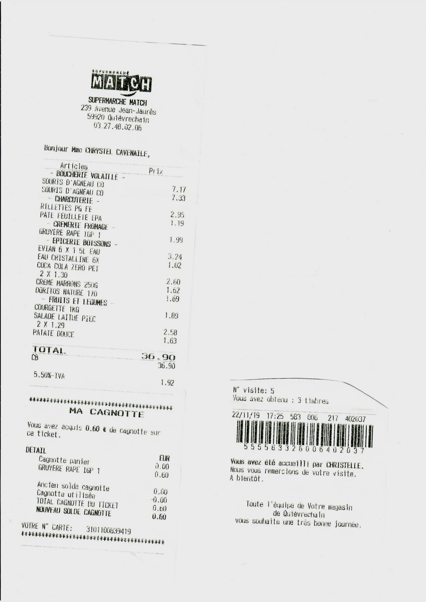
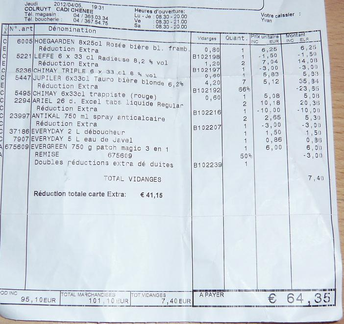
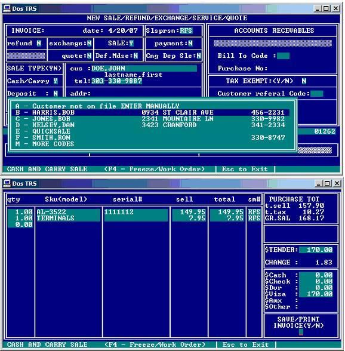
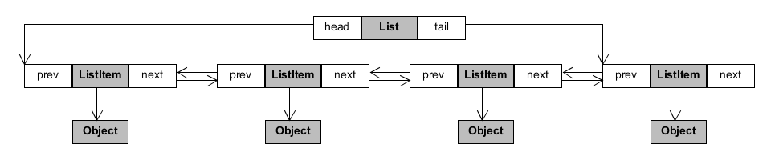
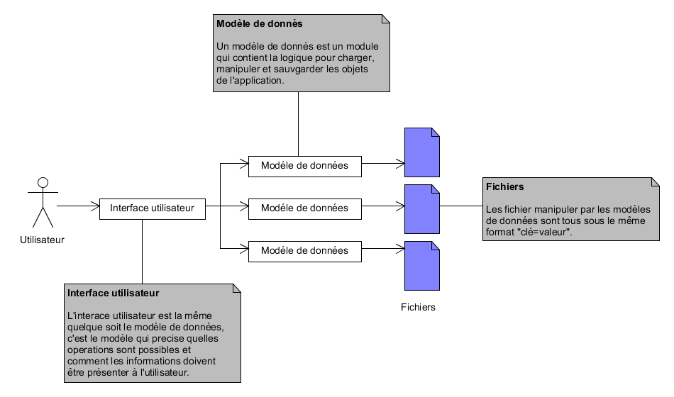
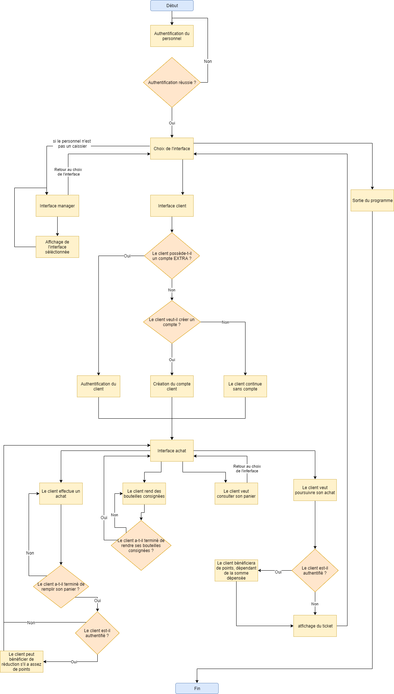

# Recherches

Des ticket de plusieurs enseignes on ete récupérés pour servir d'inspiration.
Voir figure \ref{fig-ticket-match} et \ref{fig-ticket}.





L'interface utilisateur est base sur le design des application de bureau de fin des années 80 début des années 90.
Voir figure \ref{fig-interface}.
Les racoucis claviers sont basé sur ceux de VI.



# Structure du code source et des données

## **data/**

Le dossier data contients les donnes utilser par l'application.

| Nom du fichier | Fonctionnalités                                                                         |
|----------------|:----------------------------------------------------------------------------------------|
| client.dat     | La liste des clients qui ont un compte client "extra"                                   |
| stock.dat      | La liste des articles vendu avec leur codebare, nom, catégorie, prix et promotion extra |
| user.dat       | La liste des utilisateur de l'application avec leur nom, prénom, login et mots de passe |

## client.dat

### Exemple de client :

```
BEGIN
BARECODE 7841
FIRSTNAME "Lara"
LASTNAME "Wenger"
EMAIL "Lara_We@outlook.de"
POINTS 2500
END
```
 - **BEGIN** et **END** sont des "balises" qui indique, lorsqu'on lit le client, de savoir où ses informations commençent et se terminent. De ce fait, toutes les informations du client peuvent être écrit dans n'importe quel ordre.

 - **BARECODE** est le numéro d'identification unique du client, il peut y en avoir de 0 à 9999.

 - **FIRSTNAME**, **LASTNAME** et **EMAIL** sont les informations personnelles du client.

 - **POINTS** est le nombre de points XTRA que le client possède.

## stock.dat

### Exemple d'article en stock :

```
BEGIN
BARECODE 4523
LABEL "Feuilles de bloc"
PRICE 5.000000
CONSIGNED 0.000000
DISCOUNT 15
CATEGORY 1
END
```

 - **BEGIN**, **END** et **BARECODE** fonctionnent commme pour un client dans *client.dat*.
 - **LABEL** est le nom de l'article.
 - **PRICE** est son prix.
 - **CONSIGNED** est la valeur de retour d'un article consigné, si sa valeur est 0, alors l'article n'est pas consigné.
 - **DISCOUNT** est la valeur en pourcentage du rabais.
 - **CATEGORY** est la catégorie de l'article, une valeur entière correspond à une catégorie. Les catégories existantes sont :
    - 0 : UNDEFINDED
    - 1 : OTHER
    - 2 : ALCOHOL
    - 3 : DRINK
    - 4 : FRESH_PRODUCT
    - 5 : COMPUTER
    - 6 : ELECTRONIC
    - 7 : TOYS

## user.dat

### exemple d'utilisateur : 

```
BEGIN
LOGIN "jgera"
FIRSTNAME "Jacqueline"
LASTNAME "Gerard"
PASSWORD 1969958694
ACCESS 2
END
```

 - **BEGIN** et **END** fonctionnent commme pour les fichiers '.dat' précédents.
 - **LOGIN** est le nom d'utilisateur du compte.
 - **FIRSTNAME** et **LASTNAME** sont les informations personnelles du client.
 - **PASSWORD** est un mot de passe crypté, l'utilisateur entrera une chaine de caractère pour s'authentifier dans le programme. Si la chaine entrée, traduite par le programme, correspond au code, alors la personne est authentifiée (si le LOGIN correspond également).
 - **ACCESS** correspond au niveau d'accès du compte, il en existe 3 :
    - 0 : Administrateur (aucunes restrictions)
    - 1 : Manager (peut tout modifier sauf les identifiants uniques)
    - 2 : Caissier (à accès a une partie des informations en lecture seule)

## **source/** :

## **view/**

| Nom du fichier             | Fonctionnalités                                                   |
|----------------------------|:------------------------------------------------------------------|
| home_select_what_todo.c    | Menu principal                                                    |
| cashier_select_what_todo.c | Menu client                                                       |
| cashier_input_card_id.c    | Authentification du client et création d'un nouveau compte client |
| cashier_scan_item.c        | Lecture et ajout d'articles dans le panier                        |
| return_consigned_bottles.c | Retour de bouteilles consignées                                   |
| user_login.c               | Interaface de connection de l'utilisateur.                        |
| views.h                    | Entête des fonctions contenues dans les fichiers **view/*.c**     |

## **shop/**

| Nom du fichier | Fonctionnalités                                                                |
|----------------|:-------------------------------------------------------------------------------|
| basket.c       | Modèle de données et gestion des articles contenus dans le panier d'un clients |
| clients.c      | Modèle de données et gestion des clients                                       |
| stocks.c       | Modèle de données et gestion des articles en stock                             |
| users.c        | Modèle de données et gestion des utilisateurs de l'application                 |
| barecode.c     | Gestion des codebares et indentifiant unique                                   |

## **model/** 

| Nom du fichier | Fonctionnalités                                                             |
|----------------|:----------------------------------------------------------------------------|
| action.c       | Action applicable a tout les modèles                                        |
| lexer.c        | Lecture des fichiers de données                                             |
| model.c        | Structure de données qui gèrent les accès et actions d'un modèle de données |
| user.c         | Utilisateur du système                                                      |
| view.c         | Affichage d'un modèle de données                                            |

## **utils/**

| Nom du fichier | Fonctionnalités                                                                                                |
|----------------|:---------------------------------------------------------------------------------------------------------------|
| input.c        | Entrée de l'utilisateur                                                                                        |
| list.c         | Implémentation génerique d'une liste doublement chainée                                                        |
| logger.c       | Journal de bord de l'application                                                                               |
| renderer.c     | Gestionnaire d'affichage de l'application                                                                      |
| string.c       | Utilitaire pour la manipulation de chaîne de caractères UTF-8                                                  |
| terminal.c     | Intéraction de bas niveau avec le terminal                                                                     |
| variant.c      | Type de donnée generique utilisée pour la comunication entre l'interface utilisateur et le modèle de données |
| assert.h       | Utilitaire de debuggage                                                                                        |
| math.h         | Fonctions mathematiques suplémentaires                                                                         |

## main.c

> Des fichiers '.h' sont aussi presents dans l'aborescence, ils ont les mêmes noms que les fichiers '.c', ceux-ci contiennent les entêtes des fonctions présentes dans les fichiers '.c'.


# Fonctionnement des listes chaînées

Le programme comprend 4 listes chaînées :

 - ClientsList
 - UsersList
 - StockList
 - Basket

Ces liste sont basées sur un modele de double liste chainer.
Voir figure \ref{fig-list}.



Ceci permets d'acceder plus rapidement au dernier elements de la liste en parcourant la liste depuis le dernier elements dans le cas ou l'index de l'elements est apres le milieu de la liste.

Des pointeur sans type (`void *`) sont utiliser pour permettre de pouvoir reutiliser la meme implementation de liste chainer pour plusieur conteneur.

Et les functions suivante permet de manipuler une conteneur deriver d'une liste doublement chainer:

Les fonctions présentes dans *list.c* permettent de mieux manipuler ces listes.

| Fonction &nbsp;&nbsp;&nbsp;&nbsp; | type de retour | Fonctionnalités                                                                                                               |
|-----------------------------------|----------------|-------------------------------------------------------------------------------------------------------------------------------|
| list_create                       | List*          | crée une nouvelle instance de liste chainé                                                                                                                 |
| list_destroy                      | void           | détruit l'instance de liste chainer et tout les elements qu'elle contien                                                                                                           |
| list_clear                        | void           | purge la liste                                                                                                                |
| list_clone                        | List*          | crée une copie de la liste                                                                                                                |
| list_contains                     | bool           | vérifie si la valeur existe dans la liste                                                                                     |
| list_indexof                      | int            | renvoie l'index de la position de la valeur dans la liste                                                                     |
| list_insert_sorted                | void           | insère un élement trié                                                                                                        |
| list_peek                         | bool           | retour l' elements a l'index 0 si il y en a un sinon return NULL |
| list_peekat                       | bool           | comme *list_peek* mais à un index                                                                                             |
| list_peekback                     | bool           | comme *list_peek* mais à la fin de la liste                                                                                   |
| list_pop                          | bool           | supprime le premier élément de la liste et modifie le pointeur mis en argument avec que l'élément supprimé                    |
| list_popback                      | bool           | même que *list_pop* mais avec le dernier élément                                                                              |
| list_push                         | void           | pousse un élément au début de la liste                                                                                        |
| list_pushback                     | void           | pousse un élément à la fin de la liste                                                                                        |
| list_remove                       | bool           | supprime un élément de la liste                                                                                               |

## Structures des données contenues dans les listes chainées :

```Cpp
typedef struct
{
    BareCode id;
    char label[ITEM_LABEL_SIZE];

    float price;
    int discount;
    ItemCategory category;
    bool isConsigned;
    float consignedValue;
} Item; // Représentation d'un article en stock

typedef struct
{
    BareCode id;

    char firstname[CLIENT_FIRST_NAME_SIZE];
    char lastname[CLIENT_LAST_NAME_SIZE];
    char email[CLIENT_EMAIL_SIZE];

    int points;
} Client; // Représentation d'un client qui a une carte de fidelité

typedef struct
{
    BareCode barecode;
    int quantity;
    bool is_consigne;
} BasketItem; // Représentation d'un article dans le panier d'un client

typedef struct
{
    bool pay_with_point;
    StockList *stocks;
    List *items;
    Client *owner;
} Basket; // Représentation du panier d'un client.
```


# Fonctionnement du programme 

Voici un organigramme pour simplifier l'explication du fonctionnement du programme : 

Architecture de l'application baser sur MVVM (figure \ref{fig-modele})



Navigation de l'utilisateur dans l'application (figure \ref{fig-flowchart})



## Mode d'emploi du programme :

Une fois que le personnel s'est authentifié, il sera amené à choisir 2 interfaces :

1. les interfaces manager qui contiennent la liste des clients, des produits en stock et des employés.
le personnel aura ou n'aura pas accès à certaines fonctionnalités (tels que modifier les informations d'un produit) selon son titre.

2. l'interface caissier qui permet de faire des achats et de rendre des bouteilles consignées.
Avant de passer l'achat, il faut également s'authentifier. le client à le choix, il peut soit poursuivre l'achat avec son compte déjà existant, soit en créer un, soit poursuivre sans compte.
A savoir qu'un client sans compte ne pourra pas bénéficier de réductions EXTRA si gagner des points après un achat.


Il est à noter que : 
- on peut passer d'une interface à l'autre sans devoir fermer et relancer le programme.
- chaque entité (client, produit, employé) est identifié par un code unique composé de 4 chiffres, on utilisera ce code pour retrouver cette entité (ex : si on veut acheter des poires, le client devra entrer "4387").
- si le client poursuit son achat avec un compte, il pourra bénéficier de réducition s'il a au moins 500 points. Ses points sont débités en fonction du coût de son achat s'il décide de les utiliser, dans le cas contraire, il empochera des points, dépendant aussi du coût de son achat.
- les points EXTRA n'interviennent pas dans la remise de bouteilles consignées.